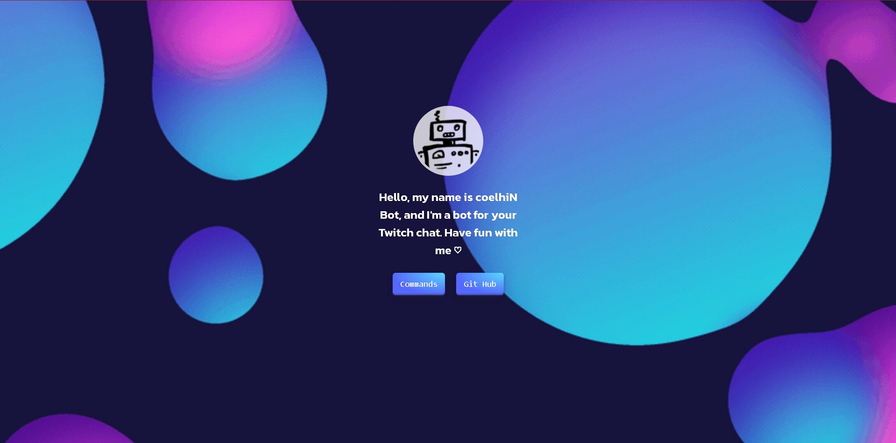
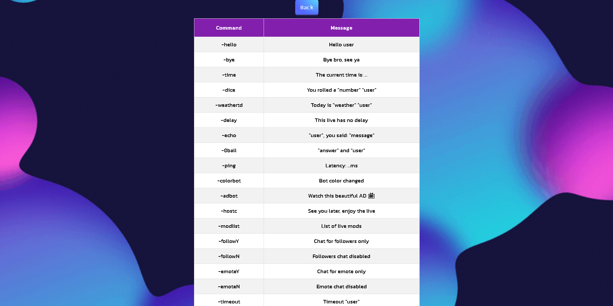

# Twitch Bot built with TypeScript.

## Preview




## Bot
- A Bot that interacts in your chat when you use the "-" prefix before the command.

## Installation
1. Clone the **[Repository](https://github.com/coelhiN77/twitch-coelhinbot)**.
    ```bash
    git clone https://github.com/coelhiN77/twitch-coelhinbot
    ```

2. Install NPM packages.
    ```bash
    cd twitch-coelhinbot/
    npm install
    ```
3. Run the bot via node scripts.
    ```bash
    Start Bot: Type in Terminal "node app.ts"
    ```

##
**Enjoy! ♡**